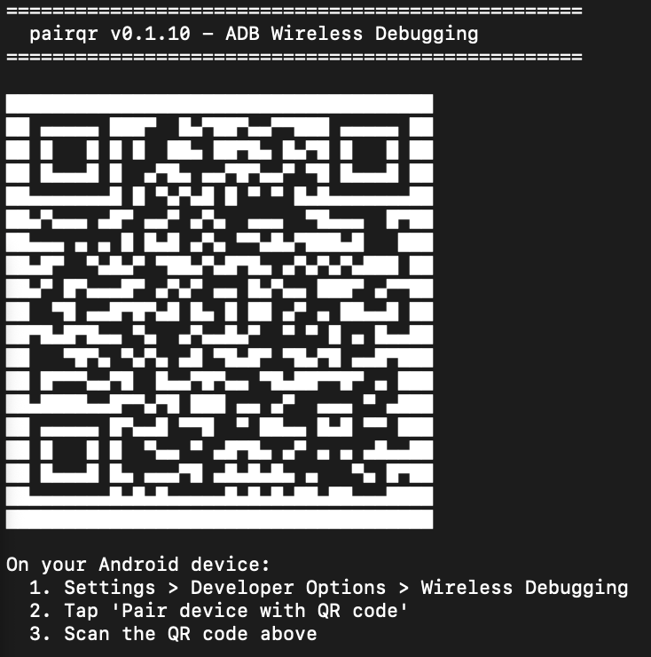

# pairqr

A command-line tool to pair Android devices for wireless ADB debugging by scanning a QR code, just like Android Studio.



## Installation

Pre-built binaries are available on the [Releases](https://github.com/richard-fairthorne/pairqr/releases) page.

Or build from source:

```bash
cargo install --path .
```

**Requirement:** ADB must be installed and in your PATH.

## Usage

1. Enable **Wireless Debugging** in your Android device's Developer Options
2. Run `pairqr`
3. Tap **Pair device with QR code** on your device and scan
